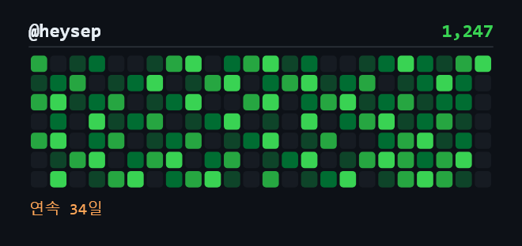
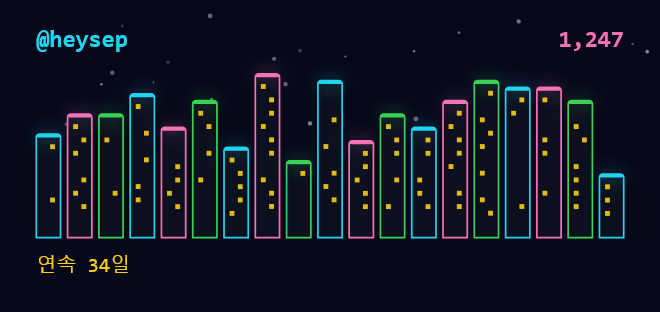
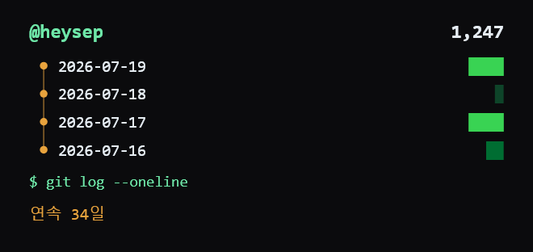

👋 안녕하세요, 한양대학교(ERICA) 스마트ICT융합공학부 재학중인 임요셉입니다.

🚀 혼자 기획 · 디자인 · 개발해서 스토어에 내는 인디 개발자입니다.

### 🔗 연락처 & SNS

---

## 🌱 GitGarden — 깃허브 잔디, 홈 화면 위젯으로

매일 깃허브에 들어가서 확인하던 잔디를, 앱 열지 않고 홈 화면에서 바로 봅니다.
**username만 입력하면 끝** — 로그인도, 토큰도, 계정 생성도 없습니다.

- 소형 · 중형 · 대형 위젯 지원, 백그라운드 자동 갱신
- 위젯 테마 8종 (기본 테마 무료, 나머지는 1회 구매로 평생 소장)
- 계정 · 광고 · 추적 없음. 데이터는 기기 안에만 저장됩니다

  
  

> Flutter + iOS WidgetKit + Android RemoteViews. 위젯 테마는 전부 `CustomPainter`로 직접 그렸습니다.

---

## 🏆 GitHub 통계

## 🧩 기술 스택 (Tech Stack)

### 📱 App

  
  
  
  

### 🎨 Frontend

  
  
  
  
  
  
  

---

### 🛠 Tools

  
  
  
  
  
  

---

### 📚 현재 학습 중

  
  
  

### 📦 그 외 프로젝트
🎵 **[Marvel Universe Explorer](https://github.com/heysep/Marvel-Movie)**
🍫 **[코코아톡 클론](https://github.com/heysep/kokoa-clone-2020)**
📖 **[밈 사전](https://github.com/heysep/internet-meme-museum)**
