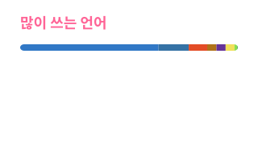

<table width="100%" align="center">
  <tr>
    <td align="center" colspan="2">
      
      
      
      
    </td>
  </tr>
  <tr>
    <td align="center" width="50%">
      
    </td>
    <td align="center" width="50%">
      
    </td>
  </tr>
</table>

### 안녕하세요, 임요셉입니다

제조 AI 회사 디알밸류에서 일하고, 혼자서는 앱을 만들어 스토어에 냅니다.

- **디알밸류** · 2024.06 ~ — 제조 AI · MES. 프론트엔드로 시작해 2025.04부터 백엔드까지
- **인디 앱** — App Store에 10개. 일기 · 달력 · 위젯 · 교통 · 게임
- **한양대학교 ERICA** — 스마트ICT융합공학부

앱은 주로 Flutter로 만들고, 홈 화면 위젯은 iOS WidgetKit · Android RemoteViews로 직접 그립니다.
토스 안에서 도는 미니앱(앱인토스)과 웹 서비스도 만듭니다.

## 출시한 앱

<table>
  <tr>
    <td align="center" width="20%"><a href="https://apps.apple.com/kr/app/id6792509021"> <b>GitGarden</b></a> 깃허브 잔디 위젯</td>
    <td align="center" width="20%"><a href="https://apps.apple.com/kr/app/id6800722213"> <b>오늘의 말씀일기</b></a> 감정에 맞는 말씀·찬양</td>
    <td align="center" width="20%"><a href="https://apps.apple.com/kr/app/id6807523619"> <b>교대노트</b></a> 교대근무 달력 · 나이트 수면</td>
    <td align="center" width="20%"><a href="https://apps.apple.com/kr/app/id6801996052"> <b>밑줄</b></a> 하루 한 문장 일기</td>
    <td align="center" width="20%"><a href="https://apps.apple.com/kr/app/id6801996296"> <b>한 컷</b></a> 하루 한 장면 일기</td>
  </tr>
  <tr>
    <td align="center"><a href="https://apps.apple.com/kr/app/id6807607144"> <b>오프라인 지하철</b></a> 첫차·막차 시간표</td>
    <td align="center"><a href="https://apps.apple.com/kr/app/id6810893575"> <b>잎갈피</b></a> 풀 이름 찾기 · 압화 잠금화면</td>
    <td align="center"><a href="https://apps.apple.com/kr/app/id6811151963"> <b>경제지표위젯</b></a> 내 포트 기준 발표 일정</td>
    <td align="center"><a href="https://apps.apple.com/kr/app/id6808442754"> <b>Keyaway</b></a> 스크린타임 잠금 키</td>
    <td align="center"><a href="https://apps.apple.com/kr/app/id6792796260"> <b>오목코치</b></a> 오목 게임</td>
  </tr>
</table>

   
  <strong>「ぼっち・ざ・ろっく！」</strong>
    
  <strong>「結束バンド」</strong>
    
  
    
  

## 기술 스택

**App** 

**Web** 

**Backend · Infra** 

**Tools** 

