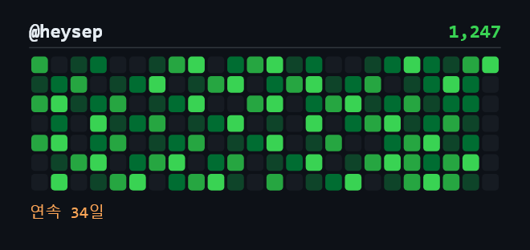
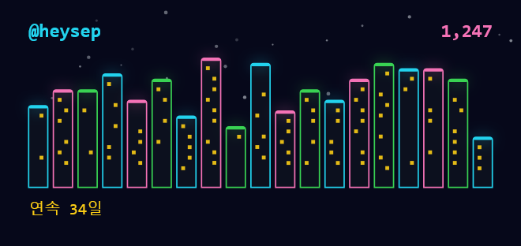
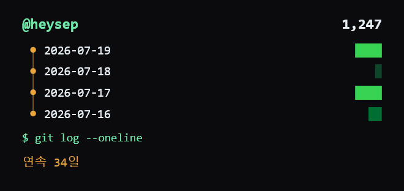

  

  

### 안녕하세요, 임요셉입니다

혼자 기획 · 디자인 · 개발해서 스토어에 내는 **인디 개발자**입니다. 한양대학교 ERICA 스마트ICT융합공학부에 다닙니다.

- **App Store에 앱 10개**를 냈습니다 — 일기 · 달력 · 위젯 · 교통 · 게임
- 대표작은 **GitGarden** — 깃허브 잔디를 홈 화면 위젯으로
- 앱은 Flutter로 만들고, 위젯은 iOS WidgetKit · Android RemoteViews로 직접 그립니다
- 토스 안에서 도는 미니앱(앱인토스)과 웹 서비스도 만듭니다

---

## GitGarden — 깃허브 잔디, 홈 화면 위젯으로

매일 깃허브에 들어가서 확인하던 잔디를, 앱 열지 않고 홈 화면에서 바로 봅니다.
**username만 입력하면 끝** — 로그인도, 토큰도, 계정 생성도 없습니다.

- 소형 · 중형 · 대형 위젯 지원, 백그라운드 자동 갱신
- 위젯 테마 8종 (기본 테마 무료, 나머지는 1회 구매로 평생 소장)
- 계정 · 광고 · 추적 없음. 데이터는 기기 안에만 저장됩니다

  
  

> Flutter + iOS WidgetKit + Android RemoteViews. 위젯 테마는 전부 `CustomPainter`로 직접 그렸습니다.

---

## 출시한 앱

<table>
  <tr>
    <td align="center" width="20%"><a href="https://apps.apple.com/kr/app/id6792509021"> <b>GitGarden</b></a> 깃허브 잔디 위젯</td>
    <td align="center" width="20%"><a href="https://apps.apple.com/kr/app/id6800722213"> <b>오늘의 말씀일기</b></a> 감정에 맞는 말씀·찬양</td>
    <td align="center" width="20%"><a href="https://apps.apple.com/kr/app/id6807523619"> <b>교대노트</b></a> 교대근무 달력 · 나이트 수면</td>
    <td align="center" width="20%"><a href="https://apps.apple.com/kr/app/id6801996052"> <b>밑줄</b></a> 하루 한 문장 일기</td>
    <td align="center" width="20%"><a href="https://apps.apple.com/kr/app/id6801996296"> <b>한 컷</b></a> 하루 한 장면 일기</td>
  </tr>
  <tr>
    <td align="center"><a href="https://apps.apple.com/kr/app/id6807607144"> <b>오프라인 지하철</b></a> 첫차·막차 시간표</td>
    <td align="center"><a href="https://apps.apple.com/kr/app/id6810893575"> <b>잎갈피</b></a> 풀 이름 찾기 · 압화 잠금화면</td>
    <td align="center"><a href="https://apps.apple.com/kr/app/id6811151963"> <b>경제지표위젯</b></a> 내 포트 기준 발표 일정</td>
    <td align="center"><a href="https://apps.apple.com/kr/app/id6808442754"> <b>Keyaway</b></a> 스크린타임 잠금 키</td>
    <td align="center"><a href="https://apps.apple.com/kr/app/id6792796260"> <b>오목코치</b></a> 오목 게임</td>
  </tr>
</table>

---

## 기술 스택 결속밴드 편성

**리드 기타 — App** 봇치 파트, 제일 오래 붙잡고 있는 것 

**베이스 — Web** 료 파트 

**드럼 — Backend · Infra** 니지카 파트, 뒤에서 박자를 잡는 것 

**보컬 — Tools** 키타 파트 

---

## 연습 기록

  
커밋 연속 기록

   
  

  

